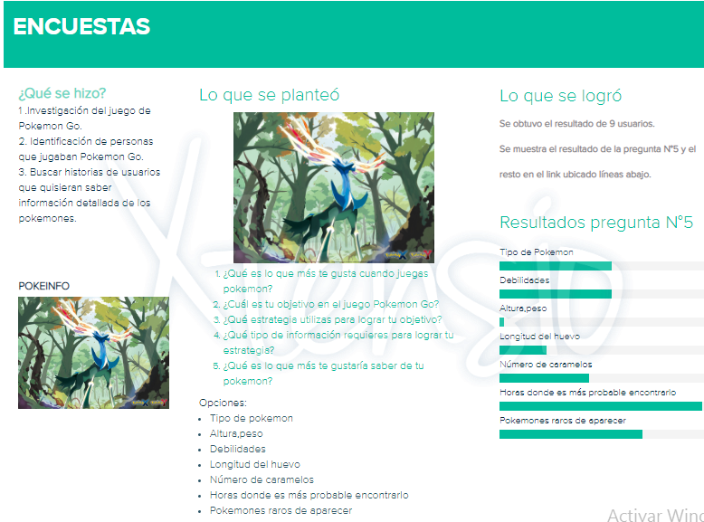

# Data Lovers

## Índice

* [Definición de Producto](#definición-de-producto)
* [Entrevistas a Usuarios](#entrevistas-de-usuario)
* [Historias de usuario](#historias-de-usuario)
* [Diseño de la interfaz de usuario](#diseño-de-la-interfaz-de-usuario)
* [Planificación del proyecto](#parte-obligatoria)
* [Futuras mejoras](#futuras-mejoras)

***

## Definición de Producto

El producto digital ha sido creado para usuarios que están comenzando a jugar POKEMON GO y 
desean conocer información detallada de cada pokemon que les permita armar sus propias 
estrategias y de esta manera, y ganar sus batallas e incrementar su nivel en el juego. 

## Entrevistas de Usuario

Se ha definido una lista de preguntas que nos ayudaron a conocer comportamientos e intereses del 
usuario final. Asimismo, que tipo de información sería útil para ellos.  

Aqui se encuentra el formulario de las preguntas :
[Formulario de Preguntas](https://docs.google.com/forms/d/e/1FAIpQLScj4EHVrirvWZtGpcBu59HPIw4af-aB2Rvfyj7xWpC8y14G1A/viewform)

Link :

[Respuesta de Encuestas](https://docs.google.com/spreadsheets/d/155COL-xGfHw_W1Xo9L6f2DwBDDi9HkGav-k_ntQI5wE/edit?usp=sharing)

### ¿Quiénes son los principales usuarios de producto?

  

### ¿Cuáles son los objetivos de estos usuarios en relación con el producto?

Los usuarios desean tener información que les permita conocer información detallada para incrementar su nivel en el juego de POKEMON GO.

### ¿Cuáles son los datos más relevantes que quieren ver en la interfaz y por qué?

Los tipos de pokemones que existen, sus debilidades, promedio de número de apariciones, horas más probables donde aparecen.

### ¿Cuándo utilizan o utilizarían el producto?

En sus tiempos libres. Generalmente emplean de 2 a 3 horas para jugar y para informarse de los pokemones que han 
capturado.

## Historias de usuario

* *Primera historia*

Visualizar la información acerca de la página.

* *Segunda historia*

Mostrar la información de todos los pokemones (nombre, altura, peso , N° de apariciones, hora probable para encontrarlo, tipo).

* *Tercera historia*

Visualizar a los todos los pokemones que se encuentren ordenado según nombre de forma ascendente (de la A a la Z) y descendente (de la Z a la A).

* *Cuarta historia*

Visualizar a los todos los pokemones que se encuentren ordenado según N° de apariciones de forma ascendente(de mayor a menor) y descendente(de menor a mayor).

* *quinta historia*

El usuario podrá buscar los pokemones según el tipo al que corresponde ya sea grass, poisson, fire, bug, normal, etc.

* *sexta historia*

El usuario podrá conocer el maximo, minimo y promedio número de apariciones de los pokemones.

* *septima historia*

El usuario podrá conocer la cantidad de pokemones según su tipo.

*NOTA:
 Para visualizar  la interfaz en versión web dar click aquí : 

 [Pokemon](https://xd.adobe.com/spec/ad70a99b-b9ad-43ac-4056-1360175da80a-db41/)

Para visualizar  la interfaz en versión movil dar click aquí : 

[Pokemon versión movil](https://xd.adobe.com/view/4e4d0db2-d7ca-4b86-50bf-7ad33529bdb8-387c/)

## Diseño de la interfaz de usuario

### *a) Prototipo de baja fidelidad*

  

*El por qué del diseño*

El diseño esta enfocado en jugadores que empiezan a jugar POKEMON GO, considerando los colores del sitio web original
e información requerida por el usuario final, se plasmó tres secciones las cuales son inicio, cards y estadisticas
que permite brindarle al usuario un diseño centrado en sus necesidades.

*Testeos de usabilidad / Sugerencias de los usuarios*

En base a lo prototipado en borrador, se procedio a mostrar a algunos usuarios y se les preguntó si entendian lo que 
deseabamos presentar en las pantallas, comentaron de que si se entendia y nos sugerieron agregar una guia de usuario.

### *b) Prototipo de alta fidelidad*

* [Adobe XD - web ](https://xd.adobe.com/spec/ad70a99b-b9ad-43ac-4056-1360175da80a-db41/): En el siguiente link se muestra cómo quedó el diseño realizado en esta herramienta.

* [Adobe XD - movil ](https://xd.adobe.com/view/4e4d0db2-d7ca-4b86-50bf-7ad33529bdb8-387c/): En el siguiente link se muestra cómo quedó el diseño realizado en esta herramienta.

* [Zeplin](https://zpl.io/aXPrw6l): Exportamos el prototipo de Adobe XD a Zeplin para tomar el código que se ajuste a nuestro diseño y poder usarlo en la implementación de la interfaz.

### Implementación de la Interfaz de Usuario (HTML/CSS/JS)

•	Con el prototipo de baja fidelidad aterrizado, procedimos a diseñarlo en Adobe XD considerando los colores del sitio web original e información requerida por el usuario final, en cada una de las pantallas se puede visualizar el contraste
y gradientes de los colores, lo cual permite al usuario familiarizarse con la aplicación.  

* Los colores empleados son los siguientes:

  

* Sobre el tipo de letra, utilizamos las fuentes de google font, que se asemejan al tipo de letra que esta plasmado en    el aplicativo de POKEMON GO.

* Mobile first: Decidimos empezar a diseñar para evitar problemas al momento de ajustar código de estilo en css. 

## Planificación del proyecto

### Tablero
Se realizo la planificacion en el tablero Kanban. Por cada historia de usuario desglozamos las actividades en tareas muy especificass para mapear y visualizar el flujo de trabajo.

### Trello

Manejamos la Herramienta de Trello para realizar un plan de trabajo mas didactico. 

### Issues
A nivel básico empleamos los issues haciendo match de lo que estaba en el tablero Kanban y en Trello.

### Excel
Colocamos todos los recursos que estructuramos y de consulta que utilizamos durante el proyecto.

 

[Excel ](https://docs.google.com/spreadsheets/d/1cX1nXme0nskAsJgKeAAP7d3QPJ4ke730Q_DPayrJPOE/edit?usp=sharing)

## Futuras mejoras

* Guía de Usuario
* Visualizaciones gráficas: Google Charts.